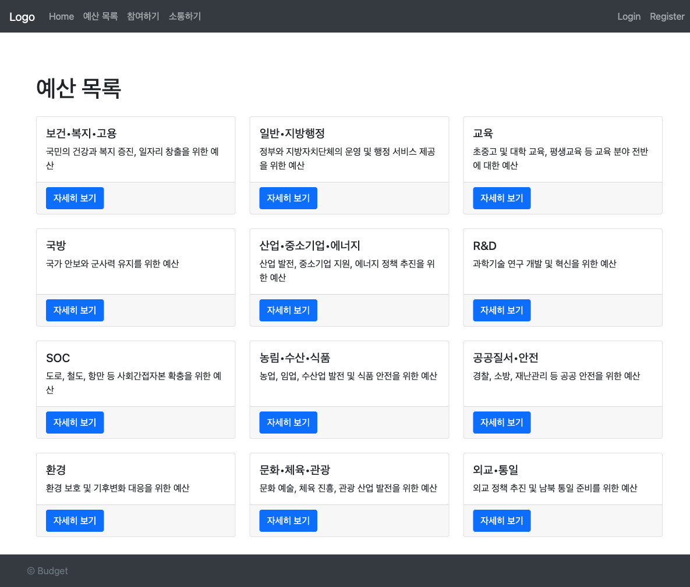

# Proj Vote

참여 예산 제안과 투표를 웹에서 진행하는 블록체인 기반 서비스입니다. NestJS + EJS로 UI를 제공하고, Voting 스마트 컨트랙트를 통해 투표를 기록합니다.

## 데모 화면



- 위 이미지는 샘플 데이터로 구성한 목업 화면입니다.

## 주요 기능

- 참여 예산 제안/투표 프로세스
- 블록체인 투표 기록(Voting.sol)
- 게시판/댓글/좋아요
- 사용자 로그인/세션 인증
- 예산 항목 관리 및 참여 집계

## 기술 스택

- NestJS, TypeScript
- PostgreSQL, TypeORM
- EJS, ejs-mate
- Passport, express-session
- Hardhat, Solidity, Ethers

## 실행 방법

```bash
npm install
npm run start:dev
```

- 기본 포트는 `3000` 입니다.
- 실행 전 `.env` 환경 변수를 설정해야 합니다.

## 환경 변수

- `DB_HOST`
- `DB_PORT`
- `DB_USERNAME`
- `DB_PASSWORD`
- `DB_NAME`
- `SESSION_SECRET`
- `SEPOLIA_URL`
- `PRIVATE_KEY`
- `VOTE_CONTRACT_ADDRESS`
- `ABI_PATH` (선택, 기본값: `artifacts/contracts/Voting.sol/Voting.json`)

## 스마트 컨트랙트

```bash
npm run hardhat:compile
npm run hardhat:deploy
npm run hardhat:test
```

## 프로젝트 구조

- `src/auth`: 세션 인증 및 로컬 로그인
- `src/users`: 사용자 관리
- `src/participation`: 참여 예산 로직
- `src/budget-items`: 예산 항목 관리
- `src/board`: 게시판/댓글/좋아요
- `src/blockchain`: 투표 컨트랙트 연동
- `contracts`: Solidity 컨트랙트
- `views`: EJS 템플릿
